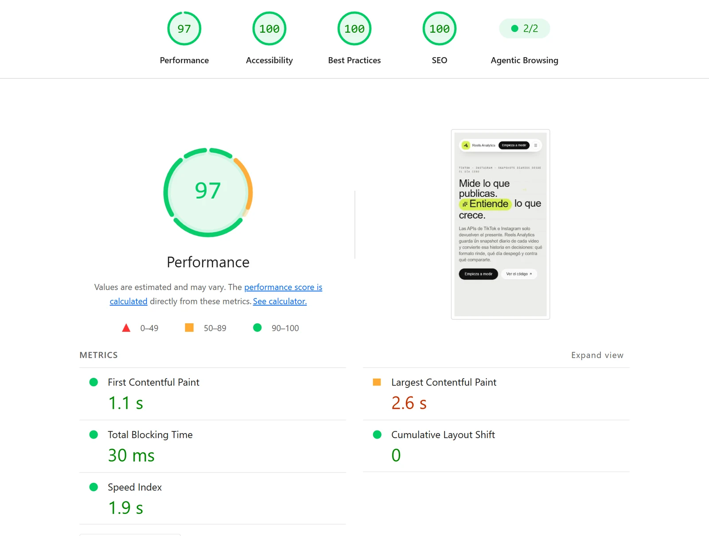
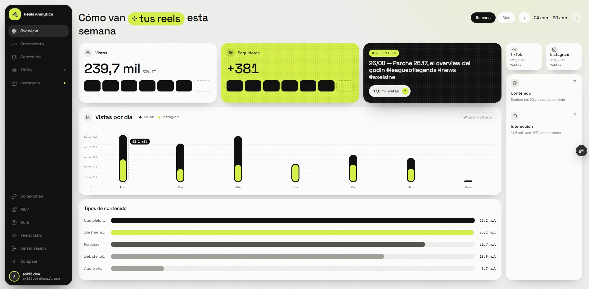

# reels-analytics

A self-hosted analytics vault for a content creator who publishes vertical videos on
**TikTok** and **Instagram (Reels)**. It centralizes both platforms in a single
database, stores **daily snapshots** to measure growth over time, and turns that
history into decisions: which format performs, which day a video took off, and what to
compare it against.

**The core idea:** official APIs return the *current state* of a metric, never its
history. Ask TikTok how many views a video has and you get today's number — ask again
next week and the old one is gone forever. The value of this app is in **capturing
snapshots every day and persisting them**; growth is computed by comparing snapshots.

> Facebook is **out of scope for now** (explicitly dropped). The design allows adding it
> later without rewriting the core.

**Live:** [reels-analytics.vercel.app/landing](https://reels-analytics.vercel.app/landing)
· [English](https://reels-analytics.vercel.app/en/landing)

---

## Quality

Measured against production, not localhost.

| Audit | Result |
|-------|--------|
| **Lighthouse** (mobile, slow 4G) | **97** performance · **100** accessibility · **100** best practices · **100** SEO |
| **[isitagentready.com](https://isitagentready.com)** | **100** — *Level 5, Agent-Native* (14 of 20 checks applicable) |
| Core Web Vitals | LCP 2.5 s · TBT 0 ms · CLS 0 |
| Test suite | 144 tests, `bun test` |

<p align="center">
  
</p>

The agent-readiness score is 100 across every applicable category — Discoverability
(3/3), Content (1/1), Bot Access Control (2/2) and API, Auth, MCP & Skill Discovery
(7/7). Commerce is not applicable. The two unreachable checks are hosting limits, not
gaps: **DNS-AID** needs a DNS zone with DNSSEC (impossible on `*.vercel.app`) and **Web
Bot Auth** is a CDN-level signature feature.

---

## The panel

<p align="center">
  
</p>

## What it does

- **Daily snapshots of every video.** A Vercel cron captures both platforms every
  morning. History accumulates whether or not anyone opens the panel.
- **Per-video growth curves.** Views at 24 h, day 7 and day 30, initial velocity, and
  the exact moment a video took off — reconstructed from the snapshot series.
- **Weekly-cohort benchmarks.** A video's "vs. typical" multiple is computed against
  the videos published *its same week*, not the whole catalog. The audience grew ~3.5×
  in six weeks, so comparing July against August would mix "better content" with "more
  followers". When a week has fewer than 4 members it falls back to the full catalog
  and says so, instead of faking precision.
- **Content types derived at read time.** The creator tags each video with an
  identifying hashtag; the type is derived from the stored `hashtags[]` through a
  dictionary ([`content-type.ts`](src/core/lib/content-type.ts)). Adding a type or an
  alias is a code edit — no migration, and the database stores raw data only.
- **Weekly Telegram digest.** Every Monday: views, followers, sections and best video.
  It doubles as an ingestion watchdog.
- **Read-only MCP server.** Ask Claude about your own analytics from wherever you
  write — see below.
- **Health endpoint** for external monitoring, and a **public bilingual landing**
  (es/en) with generated Open Graph cards.

## MCP server

The analytics are exposed to AI agents as **9 read-only tools** over Streamable HTTP:
`search_videos`, `get_video_stats`, `get_top_videos`, `get_growth_summary`,
`get_activity_timeline`, `get_hashtag_stats`, `compare_platforms`, `get_breakouts` and
`get_script_stats_block` (which emits YAML for an Obsidian script's frontmatter, so
drafts can be cross-referenced with real performance).

| Endpoint | Auth | Purpose |
|----------|------|---------|
| `/api/mcp` | **OAuth 2.1** (PKCE S256, dynamic client registration) or a static Bearer | The creator's analytics — always protected |
| `/api/public/mcp` | none | 4 informational tools: what the project is, how to request access, the catalog of protected tools, service health. No creator data. |

The app is both resource server and authorization server. Tokens are **opaque and
stored hashed** (not JWTs — that buys real revocation), audience-bound to the MCP
resource, with single-use authorization codes and refresh rotation. Anonymous requests
to `/api/mcp` get a `401` carrying `WWW-Authenticate`, which is exactly what triggers
the OAuth flow in Claude/Cowork remote connectors — that is why the public layer lives
on a separate endpoint instead of relaxing the protected one.

Agent-facing discovery is published at `/.well-known/` (RFC 8414 authorization server,
RFC 9728 protected resource, RFC 9727 API catalog, MCP server card, A2A agent card, ARD
manifest, agent skills index) plus [`/auth.md`](https://reels-analytics.vercel.app/auth.md)
and a Markdown-for-agents version of the landing at `/landing.md`. That whole surface is
written in English on purpose: it is the language of the ecosystem consuming it.

## Stack

| Layer | Technology |
|-------|-----------|
| Framework | **Next.js 16** (App Router, Server Components) |
| Language | **TypeScript** (strict) |
| Styling | **Tailwind CSS 4** |
| UI | **shadcn/ui** on **Base UI** (`@base-ui/react`), Lucide + AnimateIcons |
| Backend / DB | **Supabase** (Postgres, Auth, RLS) |
| Animation | **GSAP** (landing only, deferred to an idle chunk) |
| Hosting | **Vercel** (auto-deploy, cron jobs) |
| Package manager | **bun** (use `bun`, never npm/pnpm/yarn) |

## Getting started

```bash
bun install                 # install dependencies
bun dev                     # dev server (http://localhost:3000)
bun run build               # production build
bun run lint                # lint
bun test                    # unit tests
bunx shadcn@latest add <c>  # add a shadcn component
```

Copy `.env.example` to `.env` and fill in:

- **Supabase**: `NEXT_PUBLIC_SUPABASE_URL`, `NEXT_PUBLIC_SUPABASE_PUBLISHABLE_KEY`,
  `SUPABASE_SECRET_KEY`
- **TikTok Display API**: `TIKTOK_CLIENT_KEY`, `TIKTOK_CLIENT_SECRET`,
  `TIKTOK_REDIRECT_URI` (must match the portal registration exactly)
- **Instagram Graph API**: `INSTAGRAM_APP_ID`, `INSTAGRAM_APP_SECRET`,
  `INSTAGRAM_USER_ID`, `INSTAGRAM_ACCESS_TOKEN`
- **Jobs and access**: `CRON_SECRET`, `HEALTH_SECRET`, `MCP_SECRET`, `APP_URL`
- **Digest**: `TELEGRAM_BOT_TOKEN`, `TELEGRAM_CHAT_ID`

> Development happens against the Vercel deployment because TikTok does not accept
> `localhost` as a redirect URI.
>
> `insights.ts` aggregates by day and hour using `CREATOR_TIMEZONE` (default
> `America/Mexico_City`) because the server runs in UTC.

## Architecture

**Modular / ports & adapters.** Each platform is an isolated module implementing a
common `PlatformProvider` contract, so the analytics and UI layers never depend on the
details of any single API.

```
Platform (TikTok / Instagram)
        │  adapter implements PlatformProvider
        ▼
  Normalization (mappers → single domain model)
        ▼
  Persistence (Supabase: timestamped snapshots, daily cron)
        ▼
  Read / analytics layer (aggregates, compares over time)
        ▼
  UI (dashboard, App Router) · MCP tools · Telegram digest
```

Adapters always return the **normalized domain model**, never the raw API shape — that
conversion lives in `mappers`. Dependency rules: `modules/*` may import from `core/` but
**never** from a sibling `modules/*`; `app/` orchestrates modules but holds no business
logic; cross-platform logic lives in `modules/analytics`.

```
src/
  app/
    (dashboard)/    # Overview, Growth, Content, per-platform and per-video views
    (marketing)/    # public landing (es + /en), OG image generation
    api/            # cron jobs, MCP transports, OAuth, health
    .well-known/    # agent discovery endpoints
  modules/
    tiktok/         # Display API client, mappers, provider, OAuth, read layer
    instagram/      # Graph API client, mappers, provider, read layer
    analytics/      # cross-platform aggregation, growth, cohorts, breakouts
    ingestion/      # snapshot capture and persistence
    mcp/            # tool implementations + catalog + public tools
    oauth/          # authorization server (clients, codes, tokens)
    digest/         # weekly Telegram report
    health/         # status checks
  core/
    domain/         # normalized models + PlatformProvider contract
    supabase/       # server / admin clients + generated types
    config/         # validated env vars, canonical app identity
    lib/            # hashtag parsing, dates, content types, formatting
  components/       # dashboard, landing and shadcn UI
```

## Data model

Immutable, timestamped snapshots. All tables are prefixed `ra_` (the Supabase project is
shared) and have **RLS enabled with no policies** — access is server-side only, through
the service role.

| Table | Purpose |
|-------|---------|
| `ra_social_accounts` | one row per platform account |
| `ra_connections` | OAuth tokens (sensitive; service role only) |
| `ra_account_snapshots` | followers / total views / total likes over time |
| `ra_videos` | one row per video, with `hashtags[]`, `published_at`, duration |
| `ra_video_snapshots` | views / likes / comments / shares / saved over time |
| `ra_oauth_*` | clients, authorization codes and hashed tokens for the MCP server |

Hashtags, publish hour and weekday are **derived on ingest** — they do not exist as API
fields.

## Visual identity — "Acid Grid"

A monochrome bento with a single acid accent. Near-white canvas, near-black ink, and
**one** color: acid lime `#d9f24a`. Hierarchy comes from **size and weight**, not color.

The central rule: **lime is a surface, never text.** It is used as a background with ink
on top — never lime on white, which fails AA. The primary CTA is ink, not lime. Cards
are `rounded-lg` with shadow and no border; every control is a pill. Typography is
**Space Grotesk** throughout with **JetBrains Mono** for units, axes and tabular
figures. Both light and dark themes are supported, and
[`theme-contrast.test.ts`](src/app/theme-contrast.test.ts) fails the build if any
text/background pair drops below AA in either theme.

Always use semantic tokens (`bg-primary`, `text-muted-foreground`, `border`…), never raw
hex.

## Conventions

- TypeScript `strict`; avoid `any` without justification.
- Validate env vars in `core/config` (fail fast at boot).
- Server Components by default; `"use client"` only when interactivity demands it.
- No secrets on the client — every platform API call happens on the server.
- Motion is 150–300 ms and always honors `prefers-reduced-motion`.
- Commits in English, imperative, module-scoped when applicable (`tiktok:`, `mcp:`).

See [CLAUDE.md](CLAUDE.md) for the full contributor guide, and [ROADMAP.md](ROADMAP.md)
for the phased analytics plan.
